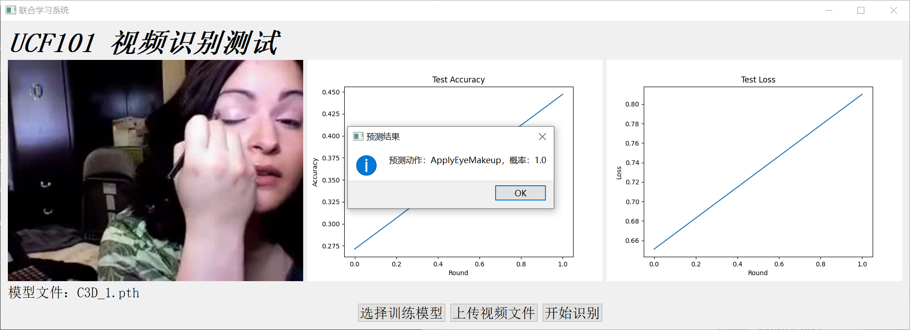

# Functions
- Training a C3D model over UCF-101 video classification dataset, using FedAvg algorithm.
- Each client and the server is a separate process, and communicates using pipes.
- GUI for using the trained model.
  

# Code Framework
[app.py](code/app.py) is the entering script for GUI. [server.py](code/server.py) is the entering script for FL training. [dataset](code/dataset) is for data processing. [client.py](code/client.py) implements the client-side logic. [comm.py](code/comm.py) implements process communication. [config.py](code/config.py) is some path configuration. [data_split.py](code/data_split.py) is a script for splitting the dataset. [network.py](code/network.py) implements the C3D network.


[res](res) is the folder for storing pretrained models. [logs](logs) is the folder for storing running logs.

## Instructions
Open [config.py](code/config.py), and modify *DATA_UCF_FD* to the path to the whole dataset. 
The dataset should have the following structure: trainlist01_*.txt gives the split for the dataset, which is generated by [data_split.py](code/data_split.py):


For quick running, we consider only five classes by default. 
If you need more classes, simply changing *SELECTED_CLASSES* is OK (no more modification is needed).

Please download the pretrained model from https://pan.baidu.com/s/1saNqGBkzZHwZpG-A5RDLVw to [res](res).

## Environment
python: 3.7.9
```
absl-py                   1.0.0
altgraph                  0.17.2
anyio                     3.5.0
argon2-cffi               21.3.0
argon2-cffi-bindings      21.2.0
attrs                     21.4.0
av                        9.2.0
Babel                     2.10.1
backcall                  0.2.0
beautifulsoup4            4.11.1
bleach                    5.0.0
cachetools                5.0.0
certifi                   2021.10.8
cffi                      1.15.0
charset-normalizer        2.0.12
colorama                  0.4.4
cycler                    0.11.0
debugpy                   1.6.0
decorator                 5.1.1
defusedxml                0.7.1
entrypoints               0.4
fastjsonschema            2.15.3
fonttools                 4.28.5
future                    0.18.2
google-auth               2.6.3
google-auth-oauthlib      0.4.6
grpcio                    1.44.0
idna                      3.3
importlib-metadata        4.11.3
importlib-resources       5.7.1
ipykernel                 6.13.0
ipython                   7.33.0
ipython-genutils          0.2.0
jedi                      0.18.1
Jinja2                    3.1.2
joblib                    1.1.0
json5                     0.9.6
jsonschema                4.4.0
jupyter-client            7.3.0
jupyter-core              4.10.0
jupyter-server            1.17.0
jupyterlab                3.3.4
jupyterlab-pygments       0.2.2
jupyterlab-server         2.13.0
kiwisolver                1.3.2
Markdown                  3.3.6
MarkupSafe                2.1.1
matplotlib                3.5.1
matplotlib-inline         0.1.3
mistune                   0.8.4
nbclassic                 0.3.7
nbclient                  0.6.0
nbconvert                 6.5.0
nbformat                  5.3.0
nest-asyncio              1.5.5
notebook                  6.4.11
notebook-shim             0.1.0
numpy                     1.21.5
oauthlib                  3.2.0
opencv-python             4.5.5.64
packaging                 21.3
pandocfilters             1.5.0
parso                     0.8.3
pefile                    2021.9.3
pickleshare               0.7.5
Pillow                    8.4.0
pip                       20.1.1
prometheus-client         0.14.1
prompt-toolkit            3.0.29
protobuf                  3.20.0
psutil                    5.9.0
pyasn1                    0.4.8
pyasn1-modules            0.2.8
pycparser                 2.21
Pygments                  2.12.0
pyinstaller               5.0.1
pyinstaller-hooks-contrib 2022.4
pyparsing                 3.0.6
PyQt5                     5.15.6
PyQt5-Qt5                 5.15.2
PyQt5-sip                 12.10.1
PyQt5-stubs               5.15.6.0
pyrsistent                0.18.1
python-dateutil           2.8.2
pytz                      2022.1
pywin32                   303
pywin32-ctypes            0.2.0
pywinpty                  2.0.5
pyzmq                     22.3.0
requests                  2.27.1
requests-oauthlib         1.3.1
rsa                       4.8
scikit-learn              1.0.2
scipy                     1.7.3
Send2Trash                1.8.0
setuptools                47.1.0
six                       1.16.0
sniffio                   1.2.0
soupsieve                 2.3.2.post1
tensorboard               2.8.0
tensorboard-data-server   0.6.1
tensorboard-plugin-wit    1.8.1
terminado                 0.13.3
threadpoolctl             3.1.0
tinycss2                  1.1.1
torch                     1.11.0+cu113
torchaudio                0.11.0+cu113
torchvision               0.12.0+cu113
tornado                   6.1
tqdm                      4.64.0
traitlets                 5.1.1
typing-extensions         4.1.1
urllib3                   1.26.9
wcwidth                   0.2.5
webencodings              0.5.1
websocket-client          1.3.2
Werkzeug                  2.1.1
wheel                     0.37.1
wxPython                  4.1.1
zipp                      3.8.0
```
